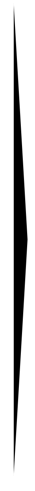
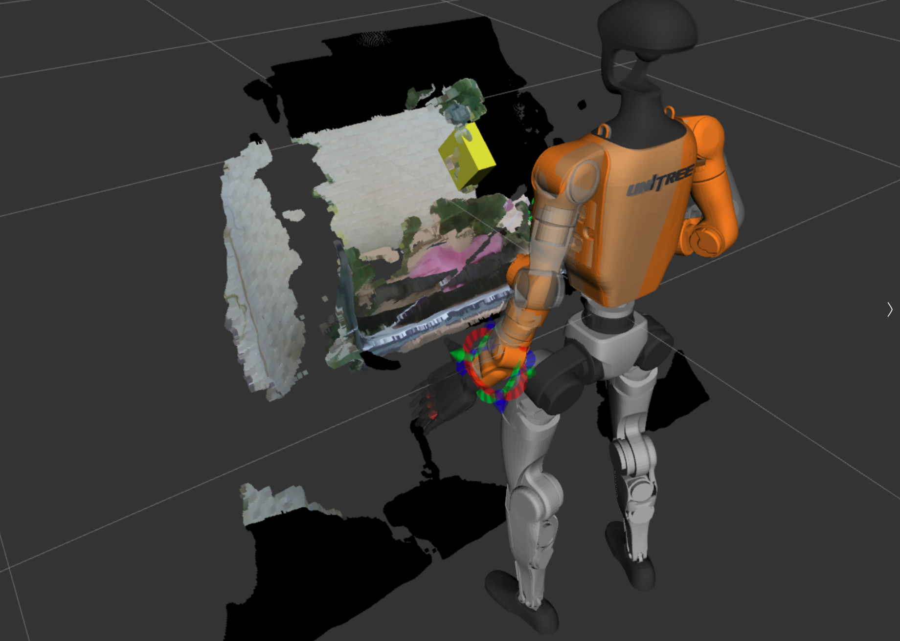

# yolo_3d_ros

[](https://github.com/Michi-Tsubaki/jsk_recognition/actions/workflows/ros2_jazzy.yml)

ROS 2 packages for running Ultralytics YOLO instance segmentation on `sensor_msgs/msg/PointCloud2` stream and publishing 3D detections, segmented point clouds and bounding boxes.

## Example (Recognition of a Grape)

###  Point Cloud 2 (Rviz2) ▶ BoundingBox3DArray (Rviz2)
  

## Setup

Please note that if `uv` (a python package manager) is not installed on your environment, `uv` will be automatically installed when you run `colcon build`.

```bash
mkdir -p <path to your colcon workspace>/src
cd <path to your colcon workspace>/src
git clone https://github.com/Michi-Tsubaki/jsk_recognition.git -b ros2
cd ..
source /opt/ros/$ROS_DISTRO/setup.bash
rosdep update
rosdep install --from-paths src -iry
cd src/jsk_recognition/yolo_3d_ros
uv sync
```

This creates `yolo_3d_ros/.venv` and installs the Python dependencies there.

```bash
cd <path to your colcon workspace>
colcon build --packages-up-to yolo_3d_ros --symlink-install
source install/setup.bash
```

`colcon build` downloads `yolo26m-seg.pt`, verifies its SHA-256 hash and installs it to
```text
<path to your colcon workspace>/install/yolo_3d_ros/share/yolo_3d_ros/models/yolo26m-seg.pt
```


## Topics

| Topic | Type |
|---|---|
| `/yolo_3d/detections` | `vision_msgs/msg/Detection3DArray` |
| `/yolo_3d/segmented_objects` | `yolo_3d_msgs/msg/SegmentedObject3DArray` |
| `/yolo_3d/segmented_points` | `sensor_msgs/msg/PointCloud2` |
| `/yolo_3d/bounding_boxes` | `vision_msgs/msg/BoundingBox3DArray` |
| `/yolo_3d/debug_image` | `sensor_msgs/msg/Image` |


## Run With RealSense

- Start RealSense with **aligned** depth and **ordered point clouds**.

```bash
sudo apt update
sudo apt install ros-jazzy-realsense2-camera
source /opt/ros/jazzy/setup.bash
ros2 launch realsense2_camera rs_launch.py align_depth.enable:=true pointcloud.enable:=true pointcloud.ordered_pc:=true
```

- Run YOLO 3D in another terminal.

```bash
source /opt/ros/jazzy/setup.bash
source <path to your colcon workspace>/install/setup.bash

ros2 launch yolo_3d_ros yolo_3d.launch.py input_topic:=/camera/depth/color/points
```

- Use `device:=cpu` to force CPU inference.
```bash
ros2 launch yolo_3d_ros yolo_3d.launch.py input_topic:=/camera/depth/color/points device:=cpu
```

- Use another checkpoint only when needed, especially when you finetune the model,

```bash
ros2 launch yolo_3d_ros yolo_3d.launch.py input_topic:=/camera/depth/color/points model:=<absolute path to the finetuned model.pt>
```

- For a D405 aimed at shine muscat or grape bunches, use the WGISD fine-tuned grape segmentation model (## Example)

```bash
ros2 launch yolo_3d_ros d405_shine_muscat_finetuned.launch.py input_topic:=/camera/depth/color/points
```

## WGISD Grape Fine-Tuning

`models/wgisd_grape_seg.pt` checkpoint was fine-tuned from `yolo11n-seg.pt` on Embrapa [WGISD](https://github.com/thsant/wgisd) COCO polygon annotations converted to a `grape` class.

For more information to finetune a model, please see `train_wgisd_grape_seg.py`.

WGISD is CC BY-NC 4.0, so the fine-tuned checkpoint should be treated as non-commercial.


## License

The yolo_3d_ros packages are AGPL-3.0-only. The Ultralytics Python package and `yolo26m-seg.pt` are governed by Ultralytics AGPL-3.0 License terms.
