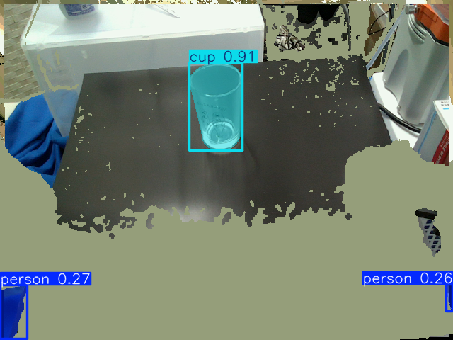

# yolo_3d_ros

ROS 2 packages for running Ultralytics YOLO instance segmentation on `sensor_msgs/msg/PointCloud2` stream and publishing 3D detections, segmented point clouds and bounding boxes.




## Setup

```bash
sudo apt update
sudo apt install -y python3-vcstool curl
curl -LsSf https://astral.sh/uv/install.sh | sh
```

Make sure `~/.local/bin` is on `PATH` if `uv` was installed with `pip --user`.


## Build

```bash
mkdir -p ~/catkin_ws/src
cd ~/catkin_ws/src
git clone https://github.com/Michi-Tsubaki/jsk_recognition.git -b ros2
cd ~/catkin_ws
vcs import src < src/jsk_recognition/yolo_3d_ros/jazzy.repos
source /opt/ros/jazzy/setup.bash
rosdep update
rosdep install --from-paths src -iry
cd src/jsk_recognition/yolo_3d_ros
uv sync
```

This creates `yolo_3d_ros/.venv`, installs the Python dependencies there.

```bash
cd ~/catkin_ws
colcon build --packages-up-to yolo_3d_ros --symlink-install
source install/setup.bash
```

`colcon build` downloads `yolo26m-seg.pt`, verifies its SHA-256 hash and installs it to

```text
~/catkin_ws/install/yolo_3d_ros/share/yolo_3d_ros/models/yolo26m-seg.pt
```


## Run With RealSense

Start RealSense with aligned depth and ordered point clouds.

```bash
source /opt/ros/jazzy/setup.bash
ros2 launch realsense2_camera rs_launch.py align_depth.enable:=true pointcloud.enable:=true pointcloud.ordered_pc:=true
```

Run YOLO 3D in another terminal.

```bash
source /opt/ros/jazzy/setup.bash
source ~/catkin_ws/install/setup.bash

ros2 launch yolo_3d_ros yolo_3d.launch.py input_topic:=/top_camera/depth/color/points
```

Use `device:=cpu` to force CPU inference.

```bash
ros2 launch yolo_3d_ros yolo_3d.launch.py input_topic:=/top_camera/depth/color/points device:=cpu
```

Use another checkpoint only when needed, especially when you finetune the model,

```bash
ros2 launch yolo_3d_ros yolo_3d.launch.py input_topic:=/top_camera/depth/color/points model:=/absolute/path/to/model.pt
```


## Topics

| Topic | Type |
|---|---|
| `/yolo_3d/detections` | `vision_msgs/msg/Detection3DArray` |
| `/yolo_3d/segmented_objects` | `yolo_3d_msgs/msg/SegmentedObject3DArray` |
| `/yolo_3d/segmented_points` | `sensor_msgs/msg/PointCloud2` |
| `/yolo_3d/bounding_boxes` | `vision_msgs/msg/BoundingBox3DArray` |
| `/yolo_3d/debug_image` | `sensor_msgs/msg/Image` |

To inspect each object cloud from `SegmentedObject3DArray`,

```bash
ros2 run yolo_3d_ros segmented_object_listener
```


## License

Repository code is Apache-2.0. The Ultralytics Python package and `yolo26m-seg.pt` are governed by Ultralytics AGPL-3.0 or Enterprise License terms.
